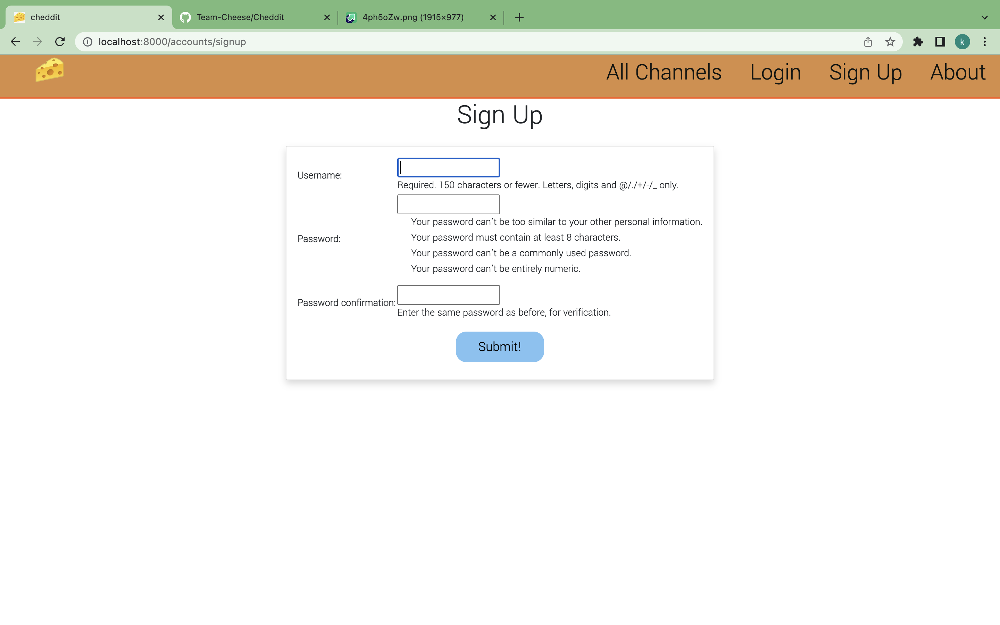
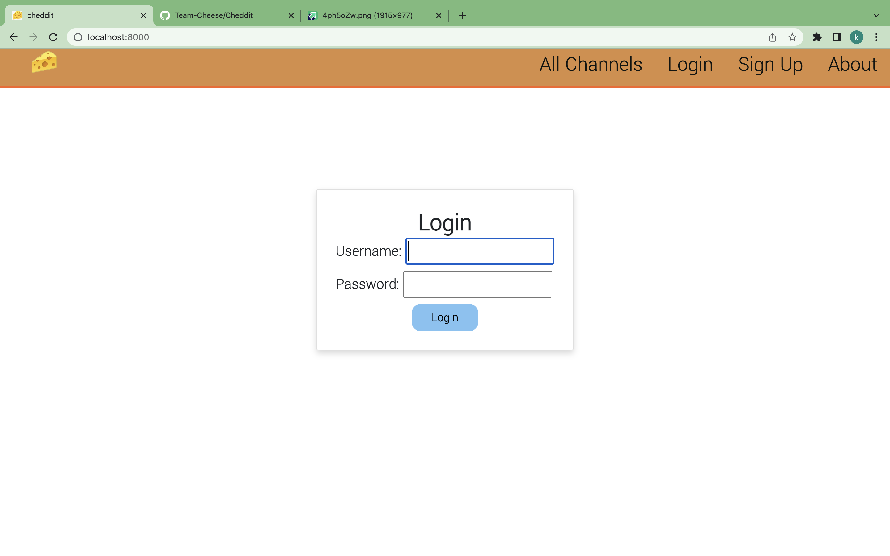

# Cheddit

Cheddit is a free to use, open source social forum. Chedditors can create new channels, add threads on other channels, and comment as much as their hearts desire!

## Getting Started:

Here are links to the [deployed applcation]() and our [Trello Board](https://trello.com/b/yD8FqOAn/unit-4-project) containing our teams project planning materials.

- Sign up
- Select a channel or create your own
- Start your new life as a Chedditor!
  
## Screenshots:

Home Screen

Sign Up

Log In

Create Thread

Create Comment

## Technologies Used:

- Django
- Python
- PostgreSQL
- Django-CKEdtior
- Heroku
- Pure CSS

## Next Steps:

In Cheddit 1.1, we plan to release the ability to create a private channels, add a up-and-down vote system, and enable moderator privileges for channel owners.

## The Team:

Koffi Hessou - Git Manager

Sun Hwang - Designer

Caleb Vietinghoff - Database Manager

Marcus Lindbloom - Scrum Manager